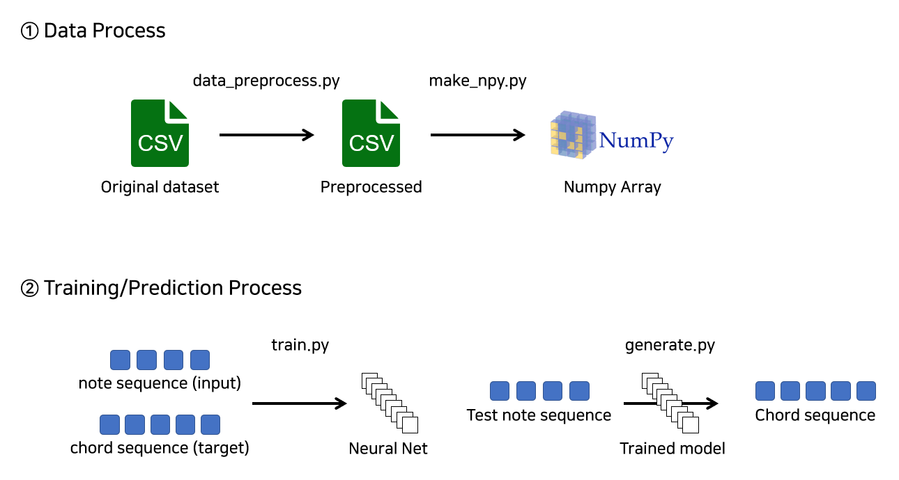

# Chord Generator with Attention LSTM
Keras implementation of "[Chord Generation from Symbolic Melody Using BLSTM Networks](https://arxiv.org/abs/1712.01011)"

## Result
[SoundCloud Link](https://soundcloud.com/chankyeong-won/sets/attention-lstm-chord-generation)  
* Piano Melody Sound : [MuseScore2](https://musescore.org)  
* Guitar Backing Sound : I play

## Dependencies
* Python 3.6
* Numpy
* Pandas
* Keras 2.2.4

## Workflow

> data_preprocess.py
* Transpose to the C key
* Convert to 2 kinds of chords (maj or min)

> make_npy.py
* Create numpy array file for training

> train.py
* Feed input/target vector into Neural net
* Train the model

> generate.py
* Generate the Chord from note sequence

## Difference with The Paper
* Neural Network Algorithm  
I compared Attention LSTM with other RNN algorithms(LSTM, BLSTM, GRU), but there was no performance difference.

* Some hyper parameters

* Preprocess method  
I didn't use the feature about note's time information(time, duration).

## Dataset
I used the [dataset](http://marg.snu.ac.kr/chord_generation/) provided in the paper, the dataset is based on the Wikifonia Dataset.